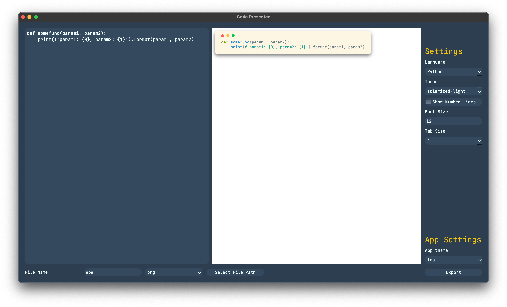
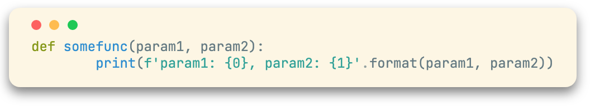

# code-presenter

knockoff carbon >:D

gogoog heres an example output

supported export formats:

.html, .png

ok cool, now here's the table of requirements >:D

| Language | Libraries |
| --- | --- |
| Python 3 | PyQt6, PyQt6-WebEngine, pygments, pillow, html2image, bs4 |

how to run this stupid thing (terminal):

1. download the project, python3
2. extract the project
3. cd in to the project location using `cd <folder>`
4. do `pip install -r requirements.txt`
5. run the project using `python3 gui.py`